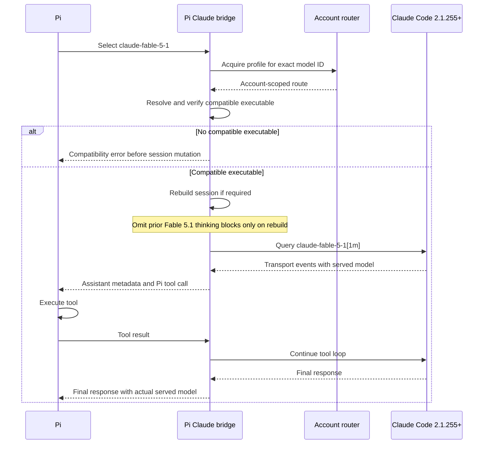

# Fable 5.1 request and rebuild sequence

```mermaid
sequenceDiagram
    participant Pi
    participant Bridge as Pi Claude bridge
    participant Router as Account router
    participant CLI as Claude Code 2.1.255+

    Pi->>Bridge: Select claude-fable-5-1
    Bridge->>Router: Acquire profile for exact model ID
    Router-->>Bridge: Account-scoped route
    Bridge->>Bridge: Resolve and verify compatible executable
    alt No compatible executable
        Bridge-->>Pi: Compatibility error before session mutation
    else Compatible executable
        Bridge->>Bridge: Rebuild session if required
        Note over Bridge: Omit prior Fable 5.1 thinking blocks only on rebuild
        Bridge->>CLI: Query claude-fable-5-1[1m]
        CLI-->>Bridge: Transport events with served model
        Bridge-->>Pi: Assistant metadata and Pi tool call
        Pi->>Pi: Execute tool
        Pi->>Bridge: Tool result
        Bridge->>CLI: Continue tool loop
        CLI-->>Bridge: Final response
        Bridge-->>Pi: Final response with actual served model
    end
```
